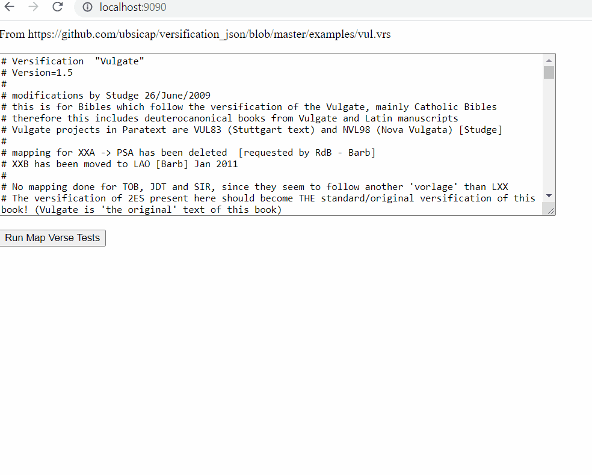

# Golang WebAssembly proof of concept
This is a proof of concept where golang WebAssembly is compared to javascript performance by making a handful of method calls to the versification methods in both golang WebAssembly and javascript.

## Was it successful? 
- From a performance standpoint, no. While running the versification methods from a native golang program was very fast (most operations are sub-millisecond), compiling to a WebAssembly produced relatively disappointing results compared to javascript. Part of this may be golang WebAssembly performance in general and part may be the marshalling of complex structures between javascript and WebAssembly.
- However, from an api usability standpoint, the code looks identical in javascript, no special hacks needed.
There are however some differences in the internal data (especially for ByteArray).

## What else could we try?
- TinyGo. This author achieved better performance with TinyGo: [Medium.com article](https://medium.com/vacatronics/webassembly-in-go-vs-javascript-a-benchmark-6deb28f24e9d) 


## The POC was done using a simple html page to demonstrate the performance. 
- Why a webpage and not a node app? While golang WebAssembly can run in node (and is documented in golang wikis), it doesn't work quite the way you'd expect by default. By default, running a golang WebAssembly in node is really like running a console application, it starts and ends when done. You have to resort to hacks to be able to use the golang WebAssembly like a library in a node app.

## Typical performance (average over 20 runs in milliseconds)

||native golang|golang WebAssembly|javascript|
|---|--- |--- |--- |
|vrs2json|0|18.25|3.75|
|succinctifyVerseMappings (forward)|1|45.9|4.2|
|mapVerse (forward)|0|0.4|0.05|
|reverseVersification|0|42.7|1|
|succinctifyVerseMappings (reverse)|0|46.35|3.7|
|mapVerse (reverse)|0|0.55|0|

## Demo
 


##  How to run this locally
- Pre-requisite: Go 13.x

- Copy wasm_exec.js to the root folder. Note: wasm_exec.js in provided by Go to allow golang .wasm files to be loaded by a browser or node. wasm_exec.js differs by version of go, so that is why it is not checked in here.
    ```
        cd <repo_root>/_poc_mapverse
        cp "$(go env GOROOT)/misc/wasm/wasm_exec.js" ./
    ```

- Compile Golang main package to a WebAssembly file:
    ```
        cd <repo_root>/_poc_mapverse
        GOOS=js GOARCH=wasm go build -o ./poc_mapverse.wasm
    ```

- Run a small golang app that opens a http listener on port 9090
    ```
        cd <repo_root>/_poc_mapverse/server
        go run main.go
    ```
- Navigate to http://localhost:9090

- Golang native timing
    ```
        cd <repo_root>/_poc_mapverse/rawgotest
        go run main.go
    ```

### Notes: 
- For this poc, I used browserify to use the proskomma-utils library in the browser. The result is checked into source, but if the bundle.js needs to be generated:
    ```
        cd <repo_root>/_poc_mapverse
        npm install
        npm install -g browserify
        npm install react-native-uuid
        browserify -r proskomma-utils > bundle.js
    ```
